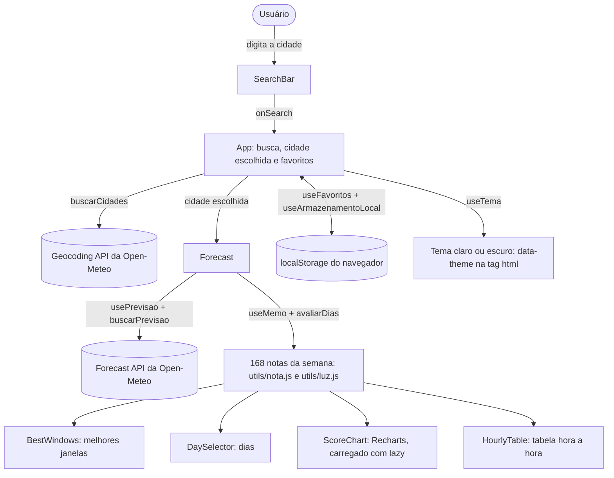

# Janela de Luz

[](https://github.com/gabrielriul/janela-de-luz/actions/workflows/deploy.yml)

> **Repositório acadêmico** criado como Projeto 1 da disciplina **ES47B – Programação Web Fullstack – ES71 (2026_02)**, do curso de Engenharia da Computação da Universidade Tecnológica Federal do Paraná (UTFPR), câmpus Cornélio Procópio.
>
> **Professora:** Profª. Drª. Juliana Costa Silva\
> **Aluno:** Gabriel Riul Perissé — RA 2064430

**App publicado:** https://gabrielriul.github.io/janela-de-luz/

## Sobre o projeto

Planejador de gravações externas. O usuário busca uma cidade, vê a previsão do tempo hora a hora para os próximos 7 dias e o app calcula uma **nota de gravação** para cada horário, considerando nuvens, chuva, vento e golden hour. As melhores janelas para gravar ficam em destaque.

O app é uma SPA (Single Page Application) feita em React que consome dados de uma API JSON pública, conforme pedido no enunciado do Projeto 1.

### Como usar

1. Busque a cidade da gravação e escolha uma das cidades encontradas.
2. Escolha o modo de gravação: **Externa**, **Drone** ou **Golden hour**.
3. Veja as **melhores janelas** da semana e clique em uma para abrir o dia dela.
4. Confira o melhor horário do dia, o resumo, o gráfico da nota e a tabela hora a hora. Passe o mouse na nota para ver o motivo.
5. Salve a cidade em **Locações salvas** para abrir a previsão com um clique na próxima vez.
6. Use o botão de lua (ou sol) na barra do topo para trocar entre o tema claro e o escuro. Sem essa escolha, o app segue o tema do sistema.

## Requisitos do Projeto 1

| Requisito do enunciado | Como foi atendido | Onde está |
| --- | --- | --- |
| Front-end com React.js e AJAX | Requisições com `fetch` e `async/await` | `src/services/openMeteo.js` |
| SPA, sem redirecionamentos | Uma única página; a tela muda por estado e renderização condicional | `src/App.jsx` |
| Uma API JSON aberta | Open-Meteo (Geocoding e Forecast) | `src/services/openMeteo.js` |
| Um hook/recurso do React da lista | `useMemo` (e também `useRef` e `lazy`) | `src/components/Forecast.jsx` |
| Uma biblioteca externa compatível com React | Recharts | `src/components/ScoreChart.jsx` |
| Aplicação integrada, não CRUDs isolados | Busca → previsão → nota → melhores janelas → gráfico → favoritos, tudo ligado | todo o `src/` |
| Repositório público com evolução por commits | Commits por etapa, fluxo `develop` → PR → `main` | [histórico de commits](https://github.com/gabrielriul/janela-de-luz/commits/main) |
| Registro das ferramentas, inclusive IA | Tabela de uso de IA | seção [Uso de IA](#uso-de-ia) |

## Escolhas do projeto

| Item | Escolha |
| --- | --- |
| API JSON | [Open-Meteo](https://open-meteo.com/) — Forecast API e Geocoding API (gratuitas, sem chave) |
| Hook do React | `useMemo` — recalcula as notas de gravação só quando a previsão ou o modo de gravação mudam |
| Biblioteca externa | [Recharts](https://recharts.org/) — gráfico hora a hora |
| Stack | React 19 + Vite, JavaScript, CSS |
| Interface | Design system **Credit Guide × Apple** (estrutura de componentes do Credit Guide com a interface do iOS), temas claro e escuro e ícones [Lucide](https://lucide.dev/) (`lucide-react`). Detalhes em [Design system](#design-system) |

## Funcionalidades

- [x] Layout base e busca de cidade (interface)
- [x] Busca de cidades na Geocoding API (carregando, sem resultados, erro e seleção da cidade)
- [x] Previsão hora a hora na Forecast API (7 dias, nascer e pôr do sol, golden hour e blue hour)
- [x] Nota de gravação por hora com `useMemo`, modos de gravação (externa, drone e golden hour) e melhores janelas da semana
- [x] Gráfico hora a hora com Recharts (nota de cada hora, faixas de golden e blue hour, dica ao passar o mouse)
- [x] Locações favoritas salvas no navegador (`localStorage`), com o último modo de gravação lembrado entre visitas
- [x] Design system Credit Guide × Apple, com tema claro e escuro (segue o sistema ou a escolha feita no botão da barra)

## Como a nota de gravação funciona

Cada hora recebe uma nota de 0 a 10 (`src/utils/nota.js`):

1. Começa em 10.
2. Perde pontos pela chance de chuva, pelo vento acima do limite do modo e pela cobertura de nuvens.
3. Ganha bônus na golden hour ou na blue hour, quando o modo valoriza essa luz.
4. Respeita a nota máxima de cada tipo de luz no modo (por exemplo, à noite o drone fica com 0).
5. Trovoadas limitam a nota a 1, e no modo drone rajadas acima de 38 km/h zeram a nota.

| Modo | O que pesa mais |
| --- | --- |
| Externa | Chuva e vento forte (ruído no áudio). A noite fica limitada a 2. |
| Drone | Vento e rajadas. Voo à noite fica com 0. |
| Golden hour | Céu aberto no nascer e no pôr do sol. Fora dessas horas a nota máxima é 4. |

As **melhores janelas** são sequências de horas seguidas com nota 6 ou mais (a constante `NOTA_BOA`, em `src/utils/nota.js`), ordenadas pela nota média (`src/utils/avaliacao.js`). Horas que já passaram não entram.

### Onde está o `useMemo`

Em `src/components/Forecast.jsx`. As 168 notas da semana (7 dias × 24 horas) e as melhores janelas ficam guardadas com `useMemo` e só são recalculadas quando chega uma previsão nova ou quando o modo de gravação muda. Trocar o dia na tabela ou destacar uma janela não refaz a conta.

### Onde está o Recharts

Em `src/components/ScoreChart.jsx`: um gráfico de colunas com a nota de cada hora do dia escolhido. As horas com nota 6 ou mais ficam na cor principal dos gráficos do design system (verde no tema claro, menta no escuro), a linha tracejada marca a nota 6 e o fundo destaca a golden hour e a blue hour. A tabela logo abaixo mostra os mesmos números.

O gráfico é carregado com `lazy` e `Suspense` (`src/components/Forecast.jsx`): o código do Recharts só é baixado quando o gráfico aparece, o que deixou o arquivo JavaScript inicial com cerca de 260 kB em vez de 630 kB.

## Arquitetura



- **Componentes** (`src/components`) só cuidam da tela. Os de `ui/` são as peças do design system.
- **Estilos** (`src/styles`) guardam os tokens do design system (cores dos dois temas, espaçamento, raios, sombras) e os estilos de texto.
- **Serviços** (`src/services`) fazem as requisições e traduzem os campos da API para o formato do app.
- **Hooks** (`src/hooks`) guardam a lógica com estado: buscar a previsão, salvar dados no navegador, o tema e a rolagem da página.
- **Utils** (`src/utils`) são funções puras: recebem dados e devolvem resultados, sem mexer na tela. Por isso dá para testar a nota sem abrir o navegador.

## Design system

A interface segue o design system **Credit Guide × Apple**: a estrutura dos componentes (nomes, props e variantes) vem do Credit Guide e o visual segue as diretrizes da Apple (fonte do sistema, cápsulas, listas agrupadas, vidro só no que flutua). O nome e o logo do Credit Guide não são usados; o Janela de Luz tem a própria marca.

- **Três camadas:** a página em cinza-claro (`neutral-150`), o conteúdo em cards brancos sem borda (`neutral-100`, raio de 20px) e a barra do topo de vidro, que fica fixa enquanto a página rola por baixo.
- **Tokens:** todas as cores e medidas são variáveis CSS em `src/styles/tokens.css`. O tema escuro troca só os valores, pelo atributo `data-theme` da tag `<html>`.
- **Tema:** o hook `useTema` segue o tema do sistema (e acompanha a mudança com `useSyncExternalStore`) até a pessoa escolher um no botão da barra; a escolha fica salva no navegador. Um script pequeno no `index.html` aplica o tema antes da primeira pintura, para a tela não piscar.
- **Texto:** fonte do sistema (San Francisco nos aparelhos Apple, Inter nos demais) e Bricolage Grotesque só no título da página. As duas fontes são servidas pelo próprio app (`src/assets/fonts`).
- **Barra do topo:** ao rolar, ganha uma linha fina e, quando o título grande passa por baixo dela, o nome da cidade aparece no centro, como no iOS (hook `useRolagemDaPagina`).

| Componente do design system | Arquivo | Onde aparece |
| --- | --- | --- |
| `Button`, `Badge`, `Chip`, `Card`, `TextInput` | `src/components/ui/` | Em toda a interface |
| `SegmentedControl` | `ui/SegmentedControl.jsx` | Modo de gravação (3 opções; setas do teclado trocam a opção) |
| `PageHeader`, `SectionTitle`, `ContentSection` | `ui/PageHeader.jsx`, `ui/ContentSection.jsx` | Título da página e seções (título, filtros, destaque, métricas e conteúdo) |
| `List`, `DataList`, `Metric` | `ui/List.jsx`, `ui/DataList.jsx`, `ui/Metric.jsx` | Cidades encontradas, detalhes da cidade e resumo do dia |
| `FeedbackPlaceholder`, `Shimmer` | `ui/FeedbackPlaceholder.jsx`, `ui/Shimmer.jsx` | Estados vazios, de erro e de carregamento |
| `OverflowXContainer`, `ResponsiveGridList`, `FlexBetweenLayout`, `MainContentContainer` | `ui/OverflowXContainer.jsx`, `ui/Layout.jsx` | Fileira de dias, grade de janelas e estrutura da página |

## Como rodar

Pré-requisito: Node.js 20.19+ ou 22.12+.

```bash
npm install
npm run dev
```

Depois é só abrir o endereço que aparecer no terminal (normalmente http://localhost:5173).

| Comando | O que faz |
| --- | --- |
| `npm run dev` | Servidor de desenvolvimento com recarga automática |
| `npm run build` | Build de produção na pasta `dist/` |
| `npm run preview` | Serve o build de produção localmente |
| `npm run lint` | Verifica o código com o oxlint |

## Fluxo de trabalho

O repositório simula o fluxo usado em equipes de produto:

| Branch | Papel |
| --- | --- |
| `main` | Produção. Só recebe código por Pull Request vindo da `develop`. Cada merge publica o app no GitHub Pages. |
| `develop` | Desenvolvimento. Todas as etapas são commitadas aqui. |

1. O trabalho é feito e commitado na `develop`.
2. Quando uma entrega está pronta, abre-se um Pull Request da `develop` para a `main`, seguindo o [template de PR](.github/pull_request_template.md).
3. O **CI** roda no Pull Request. O merge só acontece com o CI aprovado e depois da revisão.
4. O merge na `main` dispara o **deploy** para o GitHub Pages.

A `main` é protegida por uma regra no GitHub: não aceita push direto nem force push, exige Pull Request e exige o check **Lint e build** aprovado.

Os commits seguem o padrão [Conventional Commits](https://www.conventionalcommits.org/pt-br/): `feat`, `fix`, `style`, `docs`, `ci`, `chore`.

## CI/CD

| Workflow | Quando roda | O que faz |
| --- | --- | --- |
| [`ci.yml`](.github/workflows/ci.yml) | Pull Request para a `main` | `npm ci`, lint com oxlint e build de produção |
| [`deploy.yml`](.github/workflows/deploy.yml) | Push na `main` (merge de PR) | Lint, build e publicação no GitHub Pages |

## Estrutura

```
.github/
├── workflows/ci.yml       # CI: lint e build nos Pull Requests para a main
├── workflows/deploy.yml   # CD: deploy no GitHub Pages a cada merge na main
└── pull_request_template.md
src/
├── assets/fonts/ # fontes servidas pelo app (Inter e Bricolage Grotesque)
├── components/   # componentes da interface (AppHeader, SearchBar, Forecast, ScoreChart, Footer...)
│   └── ui/       # componentes do design system (Button, Card, SegmentedControl, ContentSection, List...) e ui.css
├── hooks/        # hooks personalizados (usePrevisao, useFavoritos, useArmazenamentoLocal, useTema, useRolagemDaPagina)
├── services/     # comunicação com a API (openMeteo.js)
├── styles/       # tokens do design system (temas claro e escuro) e estilos base de texto
├── utils/        # funções puras: nota de gravação, melhores janelas, luz, clima e formatação pt-BR
├── App.jsx       # componente principal: layout e estado da página
├── App.css       # estilos específicos das telas do app
└── main.jsx      # ponto de entrada do React
```

## Uso de IA

Conforme pedido no enunciado, registro aqui como usei IA generativa no desenvolvimento.

| Etapa | Ferramenta | Como foi usada | O que eu revisei / aprendi |
| --- | --- | --- | --- |
| Ideia e planejamento | Claude | Sugestão de ideias de projeto a partir do enunciado e divisão do trabalho em etapas | Escolhi a ideia e defini API, hook e biblioteca |
| Etapa 0 — criação do projeto | Claude | Execução do `create-vite` (template React) e primeiro commit | Instalei o Node.js e as dependências e criei o repositório no GitHub |
| Etapa 1 — layout base | Claude | Geração da estrutura inicial dos componentes e do CSS | Revisão do código; conceitos: componentes, props, estado com `useState`, componente controlado e renderização condicional |
| Versionamento e CI/CD | Claude | Commits no repositório e criação do workflow de CI/CD (GitHub Actions + GitHub Pages) | Ativação do GitHub Pages nas configurações do repositório; conceitos: integração contínua, deploy contínuo e build com Vite |
| Design system | Claude | Aplicação do meu design system (cores, tipografia, espaçamento, raios) e criação dos componentes base em `components/ui` | Revisão do código; conceitos: variáveis CSS, componentes reutilizáveis com props e variantes, prop `children` |
| Etapa 2 — busca de cidades | Claude | Integração com a Geocoding API da Open-Meteo, lista de cidades, estados de carregamento, erro e sem resultados | Revisão do código e teste no navegador; conceitos: `fetch` com `async/await`, `try/catch`, estado da requisição, `map` com `key` e renderização condicional |
| Fluxo de branches | Claude | Criação da branch `develop`, separação dos workflows de CI e deploy e template de Pull Request | Definição do fluxo `develop` → PR → `main` e configuração da regra de proteção da `main` no GitHub |
| Etapa 3 — previsão hora a hora | Claude | Integração com a Forecast API, hook `usePrevisao`, seleção de dia, resumo do dia, cálculo de golden/blue hour e tabela hora a hora | Revisão do código e teste no navegador; conceitos: `useEffect` com função de limpeza, hook personalizado, estado derivado, `key` para reiniciar um componente |
| Etapa 4 — nota de gravação | Claude | Regras da nota por modo, melhores janelas da semana, `useMemo` no `Forecast`, seleção de modo e destaque da janela na tabela | Revisão do código e teste no navegador; conceitos: `useMemo` e dependências, `useRef` para rolar até a tabela, funções puras e objeto de configuração por modo |
| Etapa 5 — gráfico | Claude | Gráfico de colunas com Recharts seguindo o design system, dica ao passar o mouse e carregamento sob demanda com `lazy` | Revisão do código e teste no navegador; conceitos: componentes do Recharts (`BarChart`, `Bar`, `Cell`, `ReferenceArea`, `Tooltip`), `lazy` e `Suspense`, divisão do código em partes (code splitting) |
| Etapa 6 — favoritos e acabamento | Claude | Locações salvas com `localStorage`, modo lembrado entre visitas, título da aba com a cidade, respeito à preferência de menos movimento e metadados de compartilhamento | Revisão do código e teste no navegador; conceitos: `localStorage` e JSON, inicialização preguiçosa do `useState`, hook personalizado reaproveitável, `useEffect` para mexer no DOM (`document.title`), acessibilidade com `prefers-reduced-motion` |
| Etapa 7 — revisão e documentação | Claude | Revisão do código (remoção de partes sem uso), README final com requisitos, arquitetura e como usar, e material de estudo para a defesa | Estudo do código de cada etapa para a apresentação e a defesa |
| Revisão do design system | Claude | Reaplicação do design system reformulado (Credit Guide × Apple): tokens dos temas claro e escuro, fontes servidas pelo app, componentes novos (`SegmentedControl`, `ContentSection`, `PageHeader`, `List`, `DataList`, `FeedbackPlaceholder`, `OverflowXContainer`), barra de vidro que recebe o título ao rolar e tema do gráfico | Revisão do código e teste no navegador nos dois temas, no computador e no celular; conceitos: variáveis CSS por tema com `data-theme`, `useSyncExternalStore`, `useId`, `ref` como prop no React 19 e acessibilidade do controle segmentado (setas do teclado e `aria-checked`) |

Os commits feitos com ajuda da IA trazem a linha `Co-Authored-By: Claude` na mensagem.

## Autor

**Gabriel Riul Perissé** — RA 2064430\
Engenharia da Computação — UTFPR, câmpus Cornélio Procópio

Disciplina ES47B – Programação Web Fullstack – ES71 (2026_02), com a Profª. Drª. Juliana Costa Silva.

## Créditos

Dados meteorológicos fornecidos por [Open-Meteo.com](https://open-meteo.com/) sob a licença [CC BY 4.0](https://creativecommons.org/licenses/by/4.0/).
